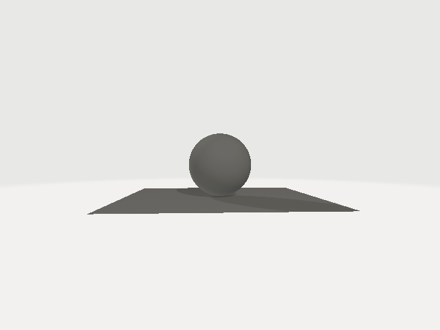
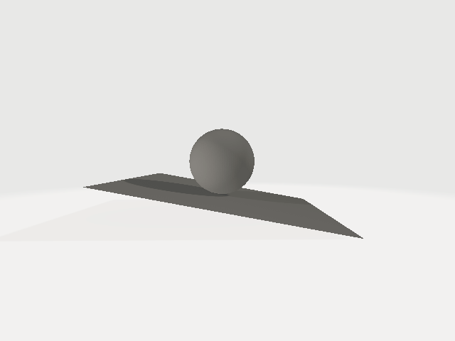
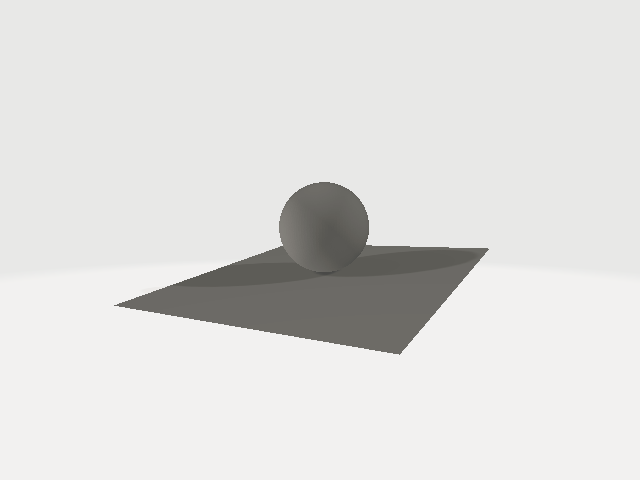
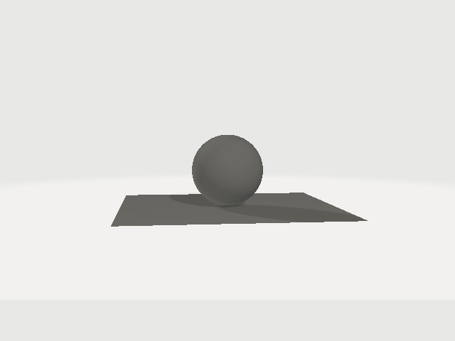
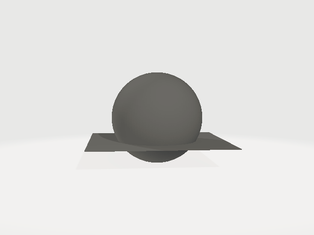
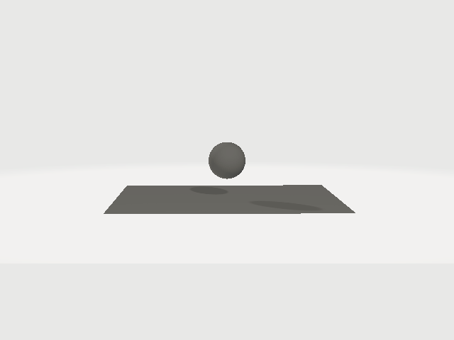
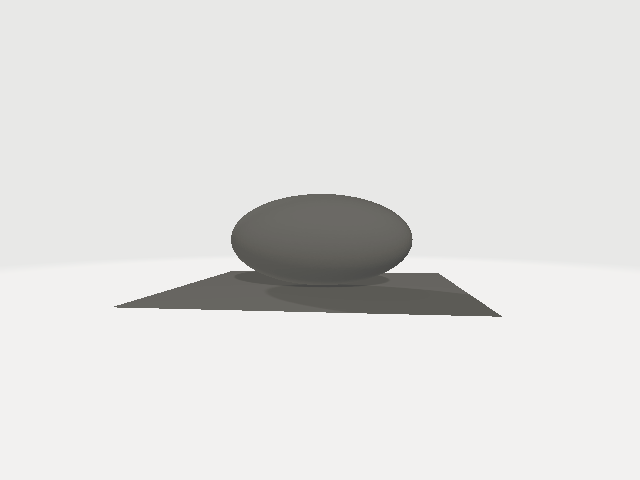
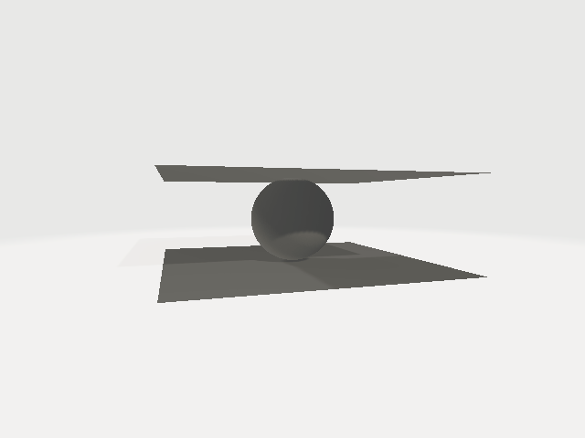
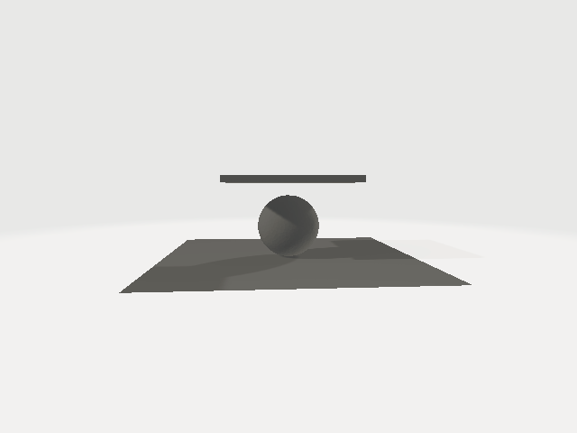

# Computer graphics course's project.
**Problem Statement**

Simulate a sphere sitting on a plane and crushed by another plane using
Codimensional Incremental Potential Contact Algorithm

**Algorithm**

1.  Create 3D models of plane, sphere

2.  Place a plane on the mesh grid

3.  Place the sphere on top ot the plane

4.  Place another plane at some distance above the sphere

5.  Set the elastic properties of the materials

6.  Set the Boundary conditions (Dirichlet Boundary Condition)

7.  Set velocity and release the upper plane

**Physical Properties to define**

1.  Mu (coefficient of friction)

- Specifies the friction between the surface of contact (plane and
  > sphere)

2.  Kappa (elastic moment)

- Specifies the tendency to rotate / deform

3.  Stiffness

- Specifies the resistance to deformation

4.  Time stepping delta

- Specifies the actions to take for next frame

5.  Density

- Specifies the density of materials

6.  E (Young’s Modulus)

- Specifies tensile or compressive stiffness of the material

7.  Nu (Poisson Ratio)

- Specifies deformation of a material in direction perpendicular to the
  > specific direction of force

8.  Thickness

9.  I (moment of Inertia)

- Tendency to resistance to stationary or motion

10. V (velocity)

- Rate of movement (plane crashing)

**3D model**

- We use .obj file format

- This file contains the information about the geometry in the form of
  > vertices (points) and faces (triangles constructed by joining the
  > vertices)

- Lighting, color, etc are not defined in this file

**Simulation using cipc code**

- We need to setup the experiment

- All the values / parameters are either 2D vectors or 3D vectors. We
  > use 3D vectors in our experiment

- 3D vectors is a 3 tuple of floating point numbers (x,y,z) representing
  > the values across x, y, z axis

- We provide the frame rate and number of frames

- We then run the simulation

- Cipc code saves the simulated frames (in the form of .obj files). We
  > can then add additional informations to the 3D models and create a
  > video for simulation

**Cipc functions / notations used**

1.  add_shell_3D(3dModel, translate, rotCenter, rotAxis, rotDeg)

- Adds a 3D object to the simulation

- Translate gives the position to place the object to

- rotCenter gives the point to rotate the object from

- rotAxis indicate the axes to rotate. (0,0,0) means don’t rotate any
  > axis and (1,1,1) means rotate along all the axes

- rotDeg give the angle to rotate the model

**<u>Examples (Sphere at (0,0,0)</u>**

1.  (“plane.obj”, (0,-1.0,0), (0,0,0), (0,0,0), 0)



2.  (“plane.obj”, (0,-1.0,0), (0,0,0), (1,0,0), 10)



3.  (“plane.obj”, (0,-1.0,0), (0,0,0), (0,1,0), 10)



2.  add_shell_with_scale_3D(3dModel, translate, scale, rotCenteDeg)

- Same as add_shell_3D but also scales by “scale” factor

- Scale = (1,1,1) means all the axes remains same dimension

- Scale = (2,2,2) means all the axes size are doubled

- Scale = (2,1,1) means only the size along x axis is doubled

- Scale = (0.5,0.5,0.5) means size across all axes is halved

**<u>Examples</u>**

1.  Scale = (1,1,1)



2.  Scale = (2,2,2)



3.  Scale = (0.5, 0.5, 0.5)



4.  Scale = (2,1,1)



3.  add_object_3D(3dModel, translate, rotCenter, rotAxis, rotDeg, scale)

- This is used to add 3d object to the experimental setup

4.  set_DBC(DBCRangeMin, DBCRangeMax, v, rotCenter, rotAxis, angVelDeg)

- This is used to set Dirichlet Boundary Condition

- For objects within range DBCRangeMin, DBCRangeMax, the velocity (v),
  > rotational freedom (rotCenter, rotAxis, angVelDeg) is set

5.  initialize_added_objects(velocity, density, nu)

- This is used to initialize the respective value for entire experiment

6.  adjust_material(3dModelReference, densityFactor, elasticityFactor)

- This can be used to alter the properties of one object.

- densityFactor is the multiplier to reduce (\<0) or increase (\>0) the
  > density of that material in comparison to the experimental setup.
  > Similarly, elasticityFactor is for Young’s Modulus

7.  sim.dt / sim.frame_dt

- Time stepping delta

8.  Sim.frame_num

- Number of frames to simulate

**Experiment**

1.  Experiment Setup (Sphere in between 2 planes)

- The lower plane is fixed by setting



2.  Crushing with Plane

- The density and Young’s Modulus (Elasticity) of the Sphere is set.

- The density and Young’s Modulus (Elasticity) of the upper plane is
  > set. Compared to the sphere, the upper plane’s density is twice and
  > Elasticity is 10000 times less (else the upper plane will also start
  > deforming).

- The upper plane is set at some distance above the sphere




# Source Codes for Codimensional Incremental Potential Contact (C-IPC)

## Reference

This repository provides source code for: 

Minchen Li, Danny M. Kaufman, Chenfanfu Jiang, [Codimensional Incremental Potential Contact](https://ipc-sim.github.io/C-IPC/), ACM Transactions on Graphics (SIGGRAPH  2021)

## Installation

### UBUNTU
Install python
```
sudo apt install python3-distutils python3-dev python3-pip python3-pybind11 zlib1g-dev libboost-all-dev libeigen3-dev freeglut3-dev libgmp3-dev
pip3 install pybind11
```
Build library
```
python build.py
```

### MacOS
Build library
```
python build_Mac.py
```

## To run paper examples

All examples can be executed with:
```
cd Projects/FEMShell
python batch.py
```
